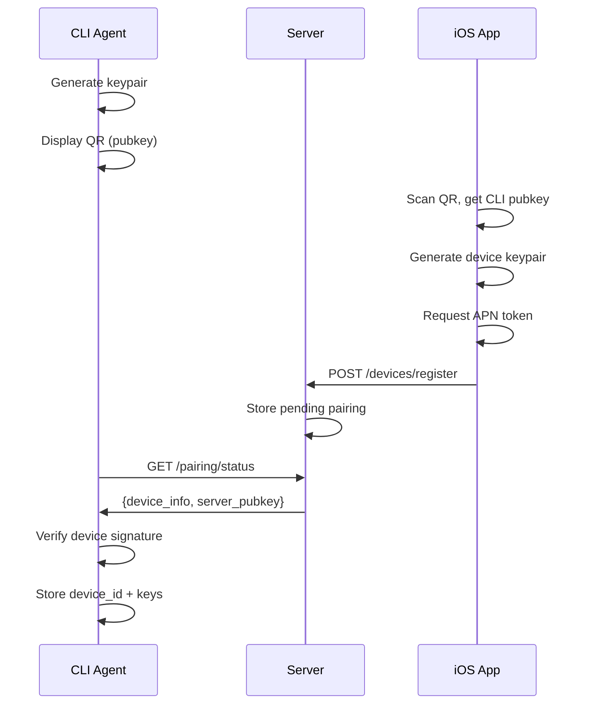
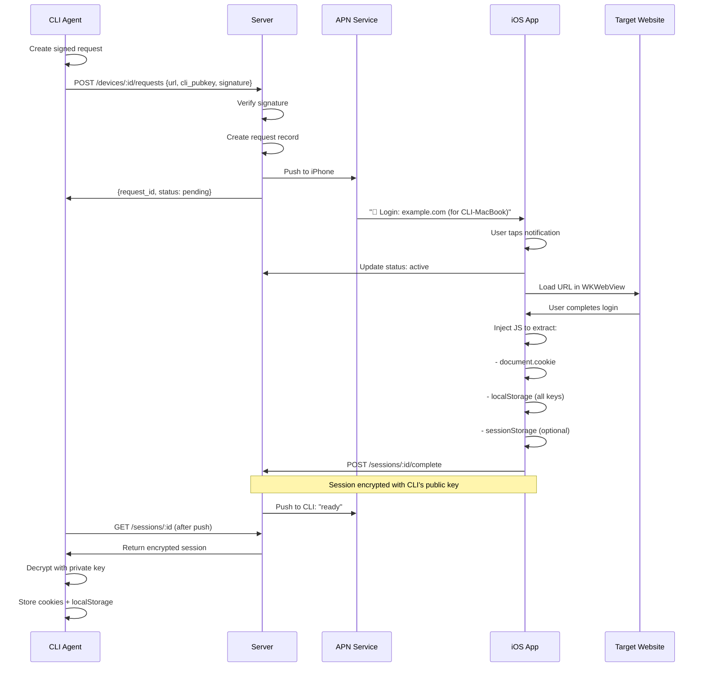

# HelpMeIn Architecture Design Draft

## Overview

HelpMeIn (帮我登进去) is a **Remote Login Proxy System** that allows CLI-based agents to delegate web authentication to a trusted mobile device.

### Core Use Case

```
[Agent in Container] --(1. Request)--> [Server] --(2. APN Push)--> [iOS Device]
                                               ^                       |
                                               |                       v
[Agent receives session] <--(5. Callback)-- [Server] <--(3. Login) [User]
                                                    <--(4. Cookies)--
```

## System Architecture

### 1. Client (CLI Agent)

**Location**: `/Client/CLI/`

**Responsibilities**:
- Initiate login requests with target URL
- Display QR code / request ID for pairing
- Poll or WebSocket for session data
- Store and manage session tokens

**Key Commands**:
```bash
helpmein login <url>              # Request remote login
helpmein status                   # Wait for APN push, then download session
helpmein devices                  # List paired devices
helpmein pair                   # Initiate device pairing
```

**Session Retrieval (No Polling)**:
- CLI sends request, enters waiting state
- When iOS completes login, APN pushes to CLI device ("ready")
- CLI queries `/v1/sessions/:id` once to download encrypted session
- No polling loop - just one request after push notification

**Tech Stack**:
- Swift (native binary via Swift Package Manager)
- AsyncHTTPClient for networking
- KeychainAccess for secure storage

### 2. Mobile Client (iOS App)

**Location**: `/Frontend/iOS/HelpMeIn/`

**Responsibilities**:
- Receive APN push notifications for login requests
- Display custom login interface (not system browser)
- Inject JavaScript to extract cookies + localStorage
- Send complete session data back to server
- Manage multiple paired CLI clients
- Secure enclave for device key storage

**Key Features**:
- Push notification handling (background + foreground)
- Custom login WebView with JavaScript injection
- Extract both cookies AND localStorage
- Session preview before sending back
- Multi-client support (one iPhone can serve multiple CLI agents)
- Secure enclave for device key storage

**Tech Stack**:
- SwiftUI for UI
- @Observable pattern for state management
- CryptoKit for key management
- UserNotifications framework for APN

### 3. Server (Backend API)

**Location**: `/Backend/Server/`

**Responsibilities**:
- Device registration and pairing
- Request routing and state management
- APN push notification delivery
- Secure session data relay
- Rate limiting and abuse prevention

**API Endpoints**:
```
POST /v1/devices/register           # Register new device
POST /v1/devices/verify             # Verify device pairing
POST /v1/devices/:id/requests          # Create login request (signed)
GET  /v1/sessions/:id                  # Download session after APN push (one-time)
POST /v1/sessions/:id/complete         # iOS completes with session data
POST /v1/push/apn                 # Internal APN delivery
```

**Tech Stack**:
- Swift + Hummingbird (Vapor alternative, lighter)
- Redis for request state storage
- PostgreSQL for device/user persistence
- APNSwift for Apple Push Notification

**Data Models**:
```swift
// Device (iPhone)
struct Device: Codable {
    let id: UUID
    let publicKey: String           // Device's ed25519 public key
    let apnToken: String
    let name: String
    let createdAt: Date
    let lastSeenAt: Date
}

// CLI Client (paired to Device)
struct CLIClient: Codable {
    let id: UUID
    let deviceId: UUID             // Which iPhone manages this CLI
    let publicKey: String          // CLI's ed25519 public key
    let name: String               // e.g., "MacBook Pro", "Server Container"
    let createdAt: Date
    let lastUsedAt: Date
}

// Login Request
struct LoginRequest: Codable {
    let id: UUID
    let targetURL: URL
    let cliClientId: UUID          // Which CLI is requesting
    let deviceId: UUID             // Which iPhone should handle it
    let status: RequestStatus       // pending | active | completed | expired
    let sessionData: SessionData?
    let createdAt: Date
    let expiresAt: Date
}

// Session Data (complete browser state)
struct SessionData: Codable {
    let cookies: [Cookie]
    let localStorage: [String: String]           // All localStorage items
    let sessionStorage: [String: String]?        // Optional: sessionStorage
    let userAgent: String
    let timestamp: Date
}
```

### 4. Website (Landing + Docs)

**Location**: `/Frontend/Web/`

**Responsibilities**:
- Product landing page
- CLI download links
- Documentation
- Privacy policy

**Tech Stack**:
- Static site generator (Hugo or VitePress)
- Hosted on GitHub Pages / Cloudflare Pages

## Security Design

### Device Pairing Flow

```
1. CLI generates keypair (ed25519)
2. CLI displays public key as QR code / text
3. User scans with iOS app
4. iOS generates its own keypair
5. iOS sends: {cli_pubkey, device_pubkey, apn_token, device_name}
6. Server verifies CLI pubkey matches pending pairing
7. Server returns: device_id, server_pubkey
8. Both sides store keys, future requests signed
```

### Request Authentication

- All requests signed with device private key
- Server verifies signature before processing
- Short-lived request IDs (5-10 min expiry)
- Rate limiting per device

### Session Data Protection

- Session data encrypted with CLI's public key
- Server cannot read session content (zero-knowledge relay)
- Auto-expire after delivery or timeout

## Data Flow

### 1. Device Pairing



### 2. Login Request (No Polling)



## Technical Decisions

### Why Hummingbird over Vapor?

- Lighter weight, faster cold start
- Better suited for simple API server
- Swift-native, consistent with client

### Why APN over WebSocket for iOS?

- WebSocket doesn't work reliably in background
- Push notification is the standard way to wake apps
- Better battery life

### Why ed25519?

- Fast signature verification
- Compact keys (good for QR codes)
- Native support in CryptoKit

## Development Phases

### Phase 1: Core Protocol (Week 1-2)

- [ ] Server: Device + CLI client registration API
- [ ] Server: Request creation + session completion API
- [ ] Server: APN push to both iOS and CLI
- [ ] iOS: Basic UI + APN handling
- [ ] iOS: WKWebView with JS injection (cookies + localStorage)
- [ ] CLI: Pairing flow (QR code)
- [ ] CLI: Request + APN wait + one-time session download

### Phase 2: Security & Polish (Week 3)

- [ ] End-to-end encryption (ed25519 + AES)
- [ ] Signature verification on all requests
- [ ] Multi-CLI support on single iPhone
- [ ] Rate limiting & request expiration
- [ ] Error handling & retry logic

### Phase 3: Features (Week 4)

- [ ] Multiple device support
- [ ] Request history
- [ ] Website landing page
- [ ] Documentation
- [ ] CLI distribution (Homebrew, etc.)

## Open Questions (Resolved)

| Question | Decision |
|----------|----------|
| CLI notification method | **APN push** (no polling) |
| Session data | **cookies + localStorage + sessionStorage** |
| iOS browser | **Custom WKWebView** with JS injection |
| Multi-user | **Yes** - one iPhone supports multiple CLI clients |

## Remaining Questions

1. **Server Hosting?**
   - Self-hosted option? (Docker compose?)
   - Managed service? (who pays?)
   - Or both?

2. **Session Storage Duration?**
   - Delete immediately after CLI downloads?
   - Keep for 24 hours for retry?
   - User-configurable?

3. **CLI Distribution?**
   - Homebrew (macOS)
   - APT/YUM (Linux)
   - Swift Package Manager? (universal)

## Next Steps

1. Create backend server scaffold (Hummingbird)
2. Set up APNS certificates / Firebase
3. Implement device pairing flow (simplest first)
4. Test end-to-end with hardcoded values
5. Add crypto layer

---

**Author**: @yukine-chan  
**Status**: Draft - Open for discussion  
**Target**: Merge as `ARCHITECTURE.md` after review
</content>