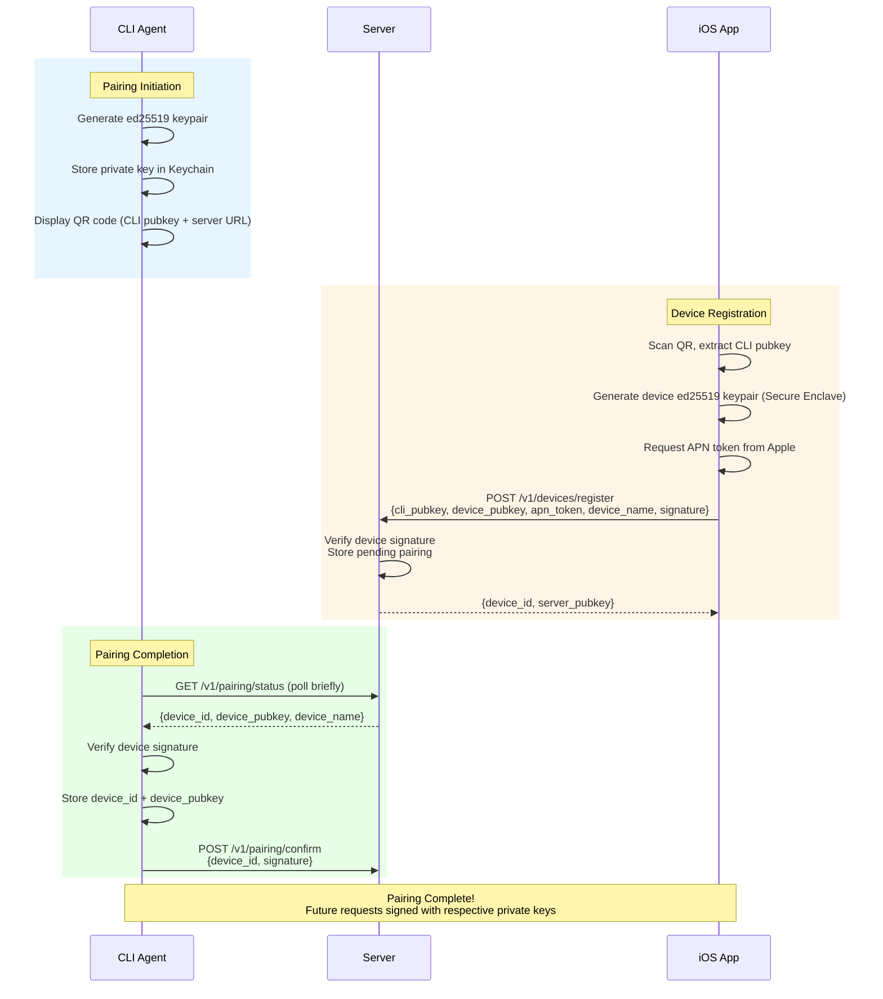
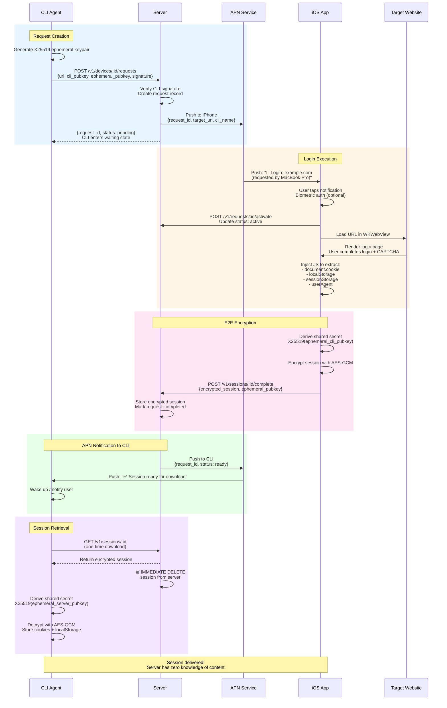
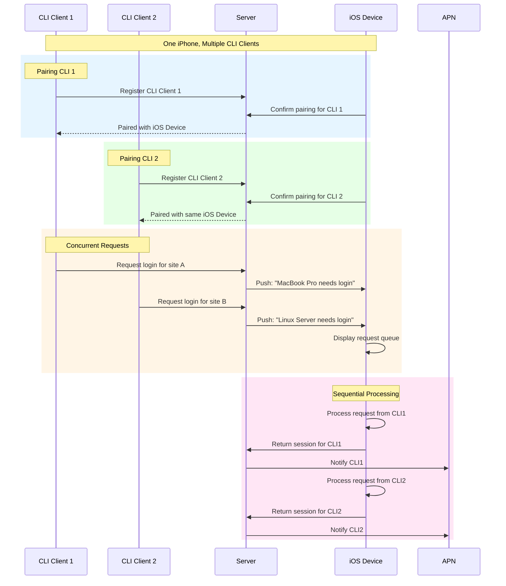

# HelpMeIn Architecture Design

## Overview

HelpMeIn (帮我登进去) is a **Remote Login Proxy System** that allows CLI-based agents to delegate web authentication to a trusted mobile device. The system uses Apple Push Notification (APN) for real-time bidirectional communication, eliminating the need for polling.

### Core Use Case

```
┌─────────────────────────────────────────────────────────────────────────────┐
│                         HelpMeIn System Flow                                │
├─────────────────────────────────────────────────────────────────────────────┤
│                                                                             │
│  ┌─────────────┐    1. Login Request    ┌──────────────┐                   │
│  │ CLI Agent   │ ────────────────────▶ │              │                   │
│  │ (Container) │                       │   Server     │                   │
│  │             │ ◀──────────────────── │   (Hummingbird)                 │
│  └─────────────┘    6. Encrypted       │              │                   │
│       ▲             Session Data       └──────┬───────┘                   │
│       │                                       │                           │
│       │ 2. APN Push: "Login Request"           │ 4. APN Push: "Ready"      │
│       │                                       │                           │
│       │                              ┌────────▼────────┐                   │
│       │                              │   iOS Device    │                   │
│       │                              │  (WKWebView)    │                   │
│       │                              │                 │                   │
│       └──────────────────────────────│ 3. User Login   │                   │
│          5. Session (cookies+        │    + CAPTCHA    │                   │
│             localStorage)             └─────────────────┘                   │
│                                                                             │
└─────────────────────────────────────────────────────────────────────────────┘
```

## System Architecture

### 1. CLI Client (Agent)

**Location**: `/Client/CLI/`

**Responsibilities**:
- Initiate login requests with target URL
- Display QR code / request ID for device pairing
- Receive APN push when session is ready
- Download encrypted session data once
- Store and manage session tokens in Keychain

**Key Commands**:
```bash
helpmein login <url>              # Request remote login
helpmein status                   # Display current request status
helpmein devices                  # List paired iOS devices
helpmein pair                     # Initiate device pairing (displays QR)
helpmein logout                   # Clear stored sessions
```

**APN Flow (No Polling)**:
```
CLI: Send request → Wait for APN (blocking or async)
APN: Push "session_ready" to CLI device
CLI: Wake up / notify user
CLI: Single GET request to download encrypted session
CLI: Decrypt and store locally
```

**Tech Stack**:
- Swift (native binary via Swift Package Manager)
- AsyncHTTPClient for networking
- KeychainAccess for secure storage
- CryptoKit for ed25519 signatures and X25519 key exchange

### 2. iOS Mobile Client

**Location**: `/Frontend/iOS/HelpMeIn/`

**Responsibilities**:
- Receive APN push notifications for login requests
- Display login interface using **WKWebView** (not system browser)
- Inject JavaScript to extract complete browser state:
  - `document.cookie` (all cookies)
  - `window.localStorage` (all keys/values)
  - `window.sessionStorage` (optional)
  - User agent string
- Encrypt session data with CLI's public key
- Send encrypted session back to server
- Manage multiple paired CLI clients
- Store device private key in Secure Enclave

**Key Features**:
- Push notification handling (background + foreground)
- Custom WKWebView with JavaScript injection
- Session preview before sending back
- Multi-client support (one iPhone serves multiple CLI agents)
- Secure Enclave for private key storage (non-exportable)
- Biometric authentication for sensitive operations

**Tech Stack**:
- SwiftUI for UI
- @Observable pattern for state management
- CryptoKit for ed25519 signatures and X25519 key exchange
- UserNotifications framework for APN
- WKWebView with custom JS injection

**JavaScript Injection for Session Extraction**:
```javascript
// Injected into WKWebView after login completes
(function() {
    return {
        cookies: document.cookie,
        localStorage: Object.entries(localStorage).reduce((acc, [k, v]) => {
            acc[k] = v;
            return acc;
        }, {}),
        sessionStorage: Object.entries(sessionStorage).reduce((acc, [k, v]) => {
            acc[k] = v;
            return acc;
        }, {}),
        userAgent: navigator.userAgent,
        url: window.location.href,
        timestamp: new Date().toISOString()
    };
})();
```

### 3. Server (Backend API)

**Location**: `/Backend/Server/`

**Responsibilities**:
- Device registration and pairing
- CLI client registration
- Request routing and state management
- APN push notification delivery to both iOS and CLI
- Secure session data relay (zero-knowledge)
- Rate limiting and abuse prevention
- Automatic session cleanup after delivery

**API Endpoints**:
```
# Device Management
POST /v1/devices/register           # Register new iOS device
POST /v1/devices/verify             # Verify device pairing completion
GET  /v1/devices/:id                # Get device info

# CLI Client Management
POST /v1/clients/register           # Register CLI client (during pairing)
GET  /v1/clients/:id                # Get CLI client info

# Request & Session
POST /v1/devices/:id/requests       # Create login request (signed)
GET  /v1/sessions/:id               # Download session after APN push (one-time)
POST /v1/sessions/:id/complete      # iOS completes with encrypted session data

# Internal
POST /v1/push/apn                   # Internal APN delivery endpoint
```

**Tech Stack**:
- Swift + Hummingbird (lightweight Vapor alternative)
- Redis for request state and ephemeral session storage
- PostgreSQL for device/user persistence
- APNSwift for Apple Push Notification

### 4. Website (Landing + Docs)

**Location**: `/Frontend/Web/`

**Responsibilities**:
- Product landing page
- CLI download links
- Documentation
- Privacy policy

**Tech Stack**:
- Static site generator (Hugo or VitePress)
- Hosted on GitHub Pages / Cloudflare Pages

## Multi-User Architecture

### Device + CLIClient Model

```
┌─────────────────────────────────────────────────────────────────┐
│                    Multi-User Relationship                      │
├─────────────────────────────────────────────────────────────────┤
│                                                                 │
│  ┌───────────────┐         ┌───────────────┐                   │
│  │  iOS Device   │◄───────►│  CLI Client 1 │  MacBook Pro       │
│  │  (iPhone)     │         │               │                    │
│  │               │◄───────►│  CLI Client 2 │  Linux Server       │
│  │  - Secure     │         │               │                    │
│  │    Enclave    │◄───────►│  CLI Client 3 │  Docker Container   │
│  │  - Biometric  │         └───────────────┘                    │
│  │    Auth       │                                              │
│  └───────────────┘                                              │
│                                                                 │
│  One iPhone can manage multiple CLI clients                     │
│  Each CLI client is independently paired and authenticated      │
│                                                                 │
└─────────────────────────────────────────────────────────────────┘
```

**Data Models**:

```swift
// Device (iPhone) - One physical device
struct Device: Codable {
    let id: UUID
    let publicKey: String           // Device's ed25519 public key
    let apnToken: String            // APN device token
    let name: String                // e.g., "Yuki's iPhone"
    let platform: String            // iOS version
    let createdAt: Date
    let lastSeenAt: Date
    let isActive: Bool
}

// CLIClient - One CLI installation, linked to one Device
struct CLIClient: Codable {
    let id: UUID
    let deviceId: UUID              // Which iPhone manages this CLI
    let publicKey: String           // CLI's ed25519 public key
    let name: String                // e.g., "MacBook Pro", "Server Container"
    let platform: String            // macOS, Linux, Docker
    let createdAt: Date
    let lastUsedAt: Date
    let isActive: Bool
}

// Login Request
struct LoginRequest: Codable {
    let id: UUID
    let targetURL: URL
    let cliClientId: UUID           // Which CLI is requesting
    let deviceId: UUID              // Which iPhone should handle it
    let status: RequestStatus        // pending | active | completed | expired
    let encryptedSessionData: String? // Encrypted with CLI's public key
    let createdAt: Date
    let expiresAt: Date             // Default: 10 minutes
    let deliveredAt: Date?            // When CLI downloaded session
    let deletedAt: Date?              // When server deleted session
}

// Session Data (complete browser state)
struct SessionData: Codable {
    let cookies: [Cookie]
    let localStorage: [String: String]           // All localStorage items
    let sessionStorage: [String: String]?        // Optional: sessionStorage
    let userAgent: String
    let url: String                              // Final URL after redirects
    let timestamp: Date
    let metadata: SessionMetadata
}

struct Cookie: Codable {
    let name: String
    let value: String
    let domain: String
    let path: String
    let secure: Bool
    let httpOnly: Bool
    let sameSite: String?
    let expiration: Date?
}
```

## Security Design

### 1. Key Management

```
┌─────────────────────────────────────────────────────────────────┐
│                      Key Hierarchy                               │
├─────────────────────────────────────────────────────────────────┤
│                                                                 │
│  Device Keypair (iOS)                                           │
│  ├── Private Key: Secure Enclave (non-exportable)              │
│  └── Public Key: Shared with Server & CLI clients              │
│                                                                 │
│  CLI Client Keypair                                             │
│  ├── Private Key: macOS Keychain / Linux keyring               │
│  └── Public Key: Shared with Server & paired iOS device        │
│                                                                 │
│  Ephemeral Keys (per-request)                                   │
│  └── X25519 key exchange for session encryption                │
│                                                                 │
│  Server Keypair                                                 │
│  └── Signs device certificates (optional PKI)                  │
│                                                                 │
└─────────────────────────────────────────────────────────────────┘
```

**Key Generation Flow**:
1. **Device Keypair**: Generated on iOS during first launch, private key stored in Secure Enclave
2. **CLI Keypair**: Generated during `helpmein pair`, private key stored in OS keychain
3. **Session Encryption**: Uses X25519 ephemeral keys combined with ed25519 identities

### 2. End-to-End Encryption (E2E)

**Session Data Encryption Flow**:

```
┌─────────────┐                          ┌─────────────┐
│   iOS App   │                          │   CLI Tool  │
│             │                          │             │
│ 1. Extract  │                          │ 4. Generate │
│    session  │                          │    X25519   │
│    data     │                          │    ephemeral│
│             │                          │    keypair  │
│ 2. Get CLI  │                          │             │
│    pubkey   │◄─────────────────────────│ 3. Include  │
│    from     │   (in login request)     │    ephemeral│
│    server   │                          │    pubkey   │
│             │                          │             │
│ 5. Derive   │                          │ 7. Derive   │
│    shared   │                          │    shared   │
│    secret   │                          │    secret   │
│    (X25519) │                          │    (X25519) │
│             │                          │             │
│ 6. Encrypt  │                          │ 8. Decrypt  │
│    with     │                          │    with     │
│    AES-GCM  │                          │    AES-GCM  │
│             │                          │             │
└─────────────┘                          └─────────────┘
```

**Encryption Algorithm**:
```swift
// X3DH-like simplified key exchange
func encryptSession(for cliPublicKey: Curve25519.KeyAgreement.PublicKey, 
                    sessionData: SessionData) throws -> EncryptedSession {
    // iOS generates ephemeral keypair
    let ephemeralKey = try Curve25519.KeyAgreement.PrivateKey()
    
    // Derive shared secret using X25519
    let sharedSecret = try ephemeralKey.sharedSecretFromKeyAgreement(with: cliPublicKey)
    
    // Derive AES key using HKDF
    let symmetricKey = sharedSecret.x963DerivedSymmetricKey(
        using: SHA256.self,
        sharedInfo: Data("HelpMeIn-v1".utf8),
        outputByteCount: 32
    )
    
    // Encrypt with AES-GCM
    let sealedBox = try AES.GCM.seal(encode(sessionData), using: symmetricKey)
    
    return EncryptedSession(
        ephemeralPublicKey: ephemeralKey.publicKey.rawRepresentation,
        ciphertext: sealedBox.combined!
    )
}
```

### 3. Request Authentication

**Signature Format**:
```swift
struct SignedRequest: Codable {
    let method: String              // HTTP method
    let path: String                // API endpoint path
    let timestamp: Int64            // Unix timestamp (prevent replay)
    let nonce: String               // 16-byte random nonce
    let bodyHash: String            // SHA256 of request body
    let publicKey: String           // Signer's public key (ed25519)
    let signature: String           // Base64-encoded signature
}
```

**Signing Algorithm**:
```
message = method + "|" + path + "|" + timestamp + "|" + nonce + "|" + bodyHash
signature = ed25519_sign(devicePrivateKey, message)
```

**Verification Steps**:
1. Verify timestamp is within ±5 minutes of server time
2. Verify nonce hasn't been used before (Redis nonce store, 10 min TTL)
3. Verify body hash matches actual request body
4. Verify signature using stored public key

### 4. Session Storage & Retention

**Retention Policy**:
```
┌─────────────────────────────────────────────────────────────┐
│                 Session Lifecycle                            │
├─────────────────────────────────────────────────────────────┤
│                                                             │
│  CREATED ──▶ PENDING ──▶ ACTIVE ──▶ COMPLETED ──▶ DELETED │
│     │          │           │            │                   │
│     │          │           │            └── CLI downloads    │
│     │          │           │                session         │
│     │          │           │                (immediate     │
│     │          │           │                 delete)        │
│     │          │           │                               │
│     │          │           └── iOS user                     │
│     │          │               completes login              │
│     │          │                                            │
│     │          └── Server sends                             │
│     │              APN to iOS                                │
│     │                                                       │
│     └── Request created                                     │
│         10-min TTL starts                                  │
│                                                             │
│  EXPIRED (if CLI never downloads)                          │
│  └── Auto-deleted after 10 minutes                        │
│                                                             │
└─────────────────────────────────────────────────────────────┘
```

**Storage Strategy**:
| Phase | Storage | TTL | Reason |
|-------|---------|-----|--------|
| Pending | Redis | 10 min | Ephemeral, fast access |
| Active | Redis | 10 min | Session being created |
| Completed | Redis | 0 min (immediate delete) | Security: no persistent storage |
| Expired | Deleted | N/A | Auto-cleanup |

**Security Properties**:
- Server never stores decrypted session data
- Session data encrypted with CLI's public key before reaching server
- Zero-knowledge relay: server cannot read session content
- Auto-delete: no session data persists after delivery
- No logs: session content never logged

## Data Flow Diagrams

### 1. Device Pairing Flow



### 2. Login Request Flow (APN Bidirectional)



### 3. Multi-CLI Support Flow



## Deployment & Distribution

### Server Hosting Options

| Option | Pros | Cons | Use Case |
|--------|------|------|----------|
| **Self-Hosted (Docker)** | Full control, privacy, no subscription | Requires maintenance, APN cert setup | Privacy-conscious users, enterprises |
| **Managed Service** | Zero setup, automatic updates, support | Subscription cost, data on third-party | Casual users, quick start |
| **Hybrid** | Choice of either | Complexity of maintaining both | Open source community |

**Recommended: Hybrid Approach**
- Default: Managed service for ease of use
- Option: Self-hosted for privacy/control
- Same protocol, interchangeable

### Self-Hosted Deployment

**Docker Compose Setup**:
```yaml
# docker-compose.yml
version: '3.8'
services:
  server:
    image: helpmein/server:latest
    ports:
      - "8080:8080"
    environment:
      - DATABASE_URL=postgresql://...  # Or use internal postgres
      - REDIS_URL=redis://redis:6379
      - APN_KEY_ID=${APN_KEY_ID}
      - APN_TEAM_ID=${APN_TEAM_ID}
      - APN_PRIVATE_KEY=${APN_PRIVATE_KEY}
    depends_on:
      - redis
      - postgres
  
  redis:
    image: redis:7-alpine
    volumes:
      - redis_data:/data
  
  postgres:
    image: postgres:15-alpine
    environment:
      - POSTGRES_DB=helpmein
      - POSTGRES_USER=helpmein
      - POSTGRES_PASSWORD=${DB_PASSWORD}
    volumes:
      - postgres_data:/var/lib/postgresql/data

volumes:
  redis_data:
  postgres_data:
```

**APN Certificate Setup**:
1. Create Apple Developer account
2. Generate APNs Auth Key (p8 format)
3. Note Key ID and Team ID
4. Set as environment variables

### CLI Distribution

| Platform | Distribution Method | Priority |
|----------|---------------------|----------|
| **macOS** | Homebrew formula | P0 |
| **macOS** | DMG direct download | P1 |
| **macOS** | Mac App Store (if allowed) | P2 |
| **Linux (deb)** | APT repository | P0 |
| **Linux (rpm)** | YUM/DNF repository | P1 |
| **Linux (universal)** | Snap / Flatpak | P2 |
| **Windows** | MSI installer / Chocolatey | P2 |
| **Universal** | Swift Package Manager | P1 |
| **Container** | Docker image with CLI | P2 |

**Homebrew Formula (Example)**:
```ruby
# helpmein.rb
class Helpmein < Formula
  desc "Remote login proxy for CLI agents"
  homepage "https://helpmein.dev"
  url "https://github.com/yukine-chan/helpmein/archive/v1.0.0.tar.gz"
  sha256 "..."
  license "MIT"

  depends_on :macos => :ventura

  def install
    system "swift", "build", "-c", "release"
    bin.install ".build/release/helpmein"
  end
end
```

**APT Repository Setup**:
```bash
# Create .deb package
dpkg-deb --build helpmein_1.0.0_amd64

# Sign and add to repository
aptly repo add helpmein-stable helpmein_1.0.0_amd64.deb
aptly publish update -gpg-key=... stable
```

### iOS App Distribution

| Channel | Method | Notes |
|---------|--------|-------|
| **App Store** | Standard release | Main distribution |
| **TestFlight** | Beta testing | Pre-release testing |
| **Enterprise** | MDM distribution | Corporate deployments |
| **Sideloading** | AltStore / Xcode | Developer builds |

## Technical Decisions

### Why Hummingbird over Vapor?

| Factor | Hummingbird | Vapor |
|--------|-------------|-------|
| Cold start | ~50ms | ~200ms |
| Memory | ~20MB | ~50MB |
| Dependencies | Minimal | Many |
| Complexity | Low | Medium |
| Swift Concurrency | Native | Good |

**Verdict**: Hummingbird for lightweight, fast startup, minimal dependencies

### Why APN over WebSocket?

| Scenario | WebSocket | APN |
|----------|-----------|-----|
| Background | ❌ Unreliable | ✅ Native support |
| Battery | High drain | Optimized |
| Delivery guarantee | None | With retry |
| iOS integration | Complex | Native |
| CLI notification | Not applicable | ✅ Works on macOS too |

**Verdict**: APN for reliable, battery-efficient, native iOS/CLI experience

### Why WKWebView over Safari?

| Feature | Safari | WKWebView |
|---------|--------|-----------|
| JS Injection | ❌ Blocked | ✅ Full control |
| Session extraction | ❌ Impossible | ✅ Cookie + storage access |
| User experience | System switch | In-app seamless |
| Cookie access | Limited | Full control |
| localStorage | No access | ✅ Full access |

**Verdict**: WKWebView for complete session extraction capability

### Why ed25519?

| Algorithm | Speed | Key Size | Security | Swift Support |
|-----------|-------|----------|----------|---------------|
| RSA-2048 | Slow | 256 bytes | Good | ✅ |
| ECDSA P-256 | Fast | 64 bytes | Good | ✅ |
| ed25519 | Very fast | 32 bytes | Excellent | ✅ CryptoKit |

**Verdict**: ed25519 for compact keys (QR-friendly), fast verification, native Swift support

## Development Phases

### Phase 1: Core Protocol (Week 1-2)

- [x] Server: Device + CLI client registration API
- [x] Server: Request creation + session completion API
- [x] Server: APN push to both iOS and CLI
- [ ] iOS: Basic UI + APN handling
- [ ] iOS: WKWebView with JS injection (cookies + localStorage + sessionStorage)
- [ ] CLI: Pairing flow (QR code display)
- [ ] CLI: Request + APN wait + one-time session download

### Phase 2: Security & Polish (Week 3)

- [ ] End-to-end encryption (X25519 + AES-GCM)
- [ ] ed25519 signature verification on all requests
- [ ] Multi-CLI support on single iPhone
- [ ] Rate limiting & request expiration (10 min)
- [ ] Session auto-delete after delivery
- [ ] Error handling & retry logic

### Phase 3: Deployment & Distribution (Week 4)

- [ ] Docker Compose self-hosted setup
- [ ] Homebrew formula
- [ ] APT repository
- [ ] iOS TestFlight distribution
- [ ] Website landing page
- [ ] Documentation

### Phase 4: Advanced Features (Week 5-6)

- [ ] Multiple device support (one CLI, multiple iPhones)
- [ ] Request history (local only)
- [ ] Session export/import
- [ ] Biometric auth for sensitive sites
- [ ] Team/enterprise features

## Open Questions (Resolved)

| Question | Decision | Rationale |
|----------|----------|-----------|
| CLI notification method | **APN push** | No polling, battery efficient, native |
| Session data scope | **cookies + localStorage + sessionStorage** | Complete browser state |
| iOS browser | **WKWebView** | JS injection for full session extraction |
| Multi-user support | **Yes** | One iPhone → multiple CLI clients |
| Session retention | **Immediate delete** | Security first, download then delete |
| Server hosting | **Hybrid** | Managed default, self-hosted option |
| Encryption | **X25519 + AES-GCM** | Modern, fast, well-reviewed |
| Signatures | **ed25519** | Compact, fast, native Swift |
| Key storage | **Secure Enclave / Keychain** | Hardware-backed security |

## Security Checklist

- [x] All requests signed with ed25519
- [x] Session data E2E encrypted (server zero-knowledge)
- [x] Private keys in Secure Enclave / Keychain
- [x] Session deleted immediately after download
- [x] Timestamp + nonce replay protection
- [x] Rate limiting per device/client
- [x] Short-lived request TTL (10 min)
- [x] Biometric auth for sensitive operations (iOS)
- [ ] Security audit (Phase 2 completion)
- [ ] Bug bounty program (Post-launch)

## Next Steps

1. ✅ Create backend server scaffold (Hummingbird)
2. 🔄 Set up APNS certificates / Firebase
3. 🔄 Implement device pairing flow (simplest first)
4. ⏳ Test end-to-end with hardcoded values
5. ⏳ Add crypto layer (X25519 + AES-GCM)
6. ⏳ Create Docker Compose setup
7. ⏳ Build Homebrew formula
8. ⏳ iOS TestFlight build

---

**Author**: @yukine-chan  
**Status**: Ready for implementation  
**Version**: 2.0  
**Last Updated**: 2026-03-28